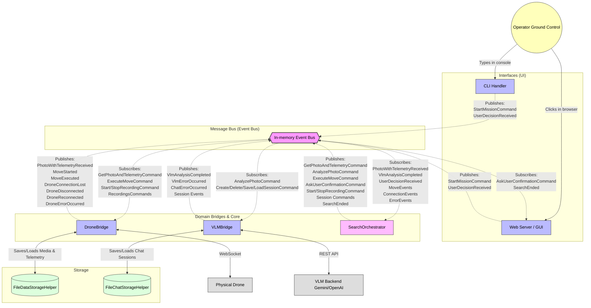

# Mission Control (FlySearch)

This directory contains the ground control station ("Mission Control") for the FlySearch UAV project. It serves as the central hub connecting the operator, the drone (Raspberry Pi), and the Vision Language Model (VLM) responsible for autonomous visual search.

## Overview

The Mission Control module manages end-to-end communication during the drone's flight. It receives telemetry and photos from the drone via a WebSocket connection, overlays a coordinate grid on the images, and forwards them to a VLM (such as Gemini or GPT) to decide on the next movement. 

It provides two user interfaces:
1. **Command Line Interface (CLI)**: For typing direct commands and orchestrating the automated search.
2. **Web GUI**: A FastAPI-based dashboard that allows the operator to preview the drone's current camera feed, read the VLM's reasoning, and confirm/reject proposed actions.

## Key Components

* **Drone Bridge**: Runs a WebSocket server to listen for drone connections, process binary photos, receive telemetry data, and pull video recordings.
* **VLM Bridge**: Handles the communication with the selected Vision Language Model, parsing its XML-formatted responses (e.g., `<action>(x, y, z)</action>`) into actionable drone commands.
* **Chat Manager & Prompt Manager**: Manages the conversation history with the model and generates instructions based on the `FS-1` or `FS-2` search strategies.
* **Image Processing**: Automatically crops incoming drone photos to a square format and overlays a dot-matrix grid to help the VLM understand distance and movement scaling.

## Configuration

The module is configured using environment variables defined in the `Config` class, using envirnomental variables. Important variables include:

* `MODEL_BACKEND`: The LLM backend to use (default: `gemini`).
* `MODEL_NAME`: The specific model version (default: `gemini-2.5-flash`).
* `GEMINI_AI_KEY` / `OPEN_AI_KEY`: API keys for the respective VLM backends.
* `WS_HOST` & `WS_PORT`: Host and port for the Drone WebSocket server (defaults to `0.0.0.0:8080`).

## Usage (CLI Commands)

Once the `main.py` script is running, the following commands are available in the prompt:

**Automated Search**
* `SEARCH <name> <FS-1|FS-2> [object=.. glimpses=.. area=.. minimum_altitude=..]`: Orchestrates the entire automated search loop, interacting with the VLM until the object is found.

**Drone Communication**
* `PHOTO_WITH_TELEMETRY`: Requests a single photo and telemetry update.
* `START_RECORDING` / `STOP_RECORDING`: Controls the `.h264` video recording on the drone.
* `GET_RECORDINGS` / `PULL_RECORDINGS <names>`: Lists and downloads video files from the drone, automatically converting them to `.mp4`.
* `MOVE`: Executes the last parsed movement command.

**VLM & Chat Management**
* `PROMPT <FS-1|FS-2>`: Generates the system instructions.
* `CHAT_INIT` / `CHAT_SAVE <name>` / `CHAT_RETRIEVE <name>` / `CHAT_RESET`: Manages session persistence.
* `SEND_TO_VLM` / `ADD_WARNING`: Manually triggers the VLM or sends a collision warning.

## Architecture
The system is based on an event-driven architecture.

